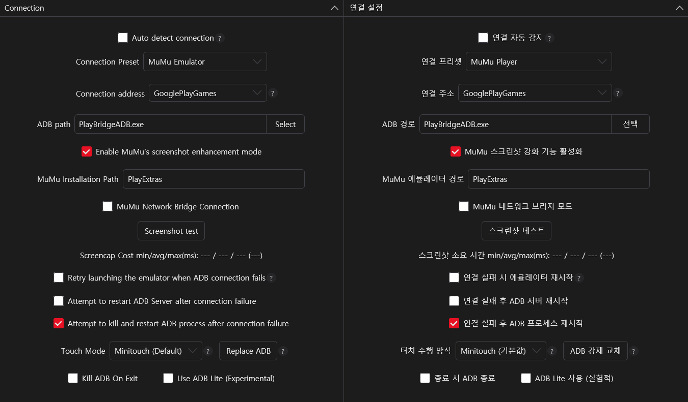
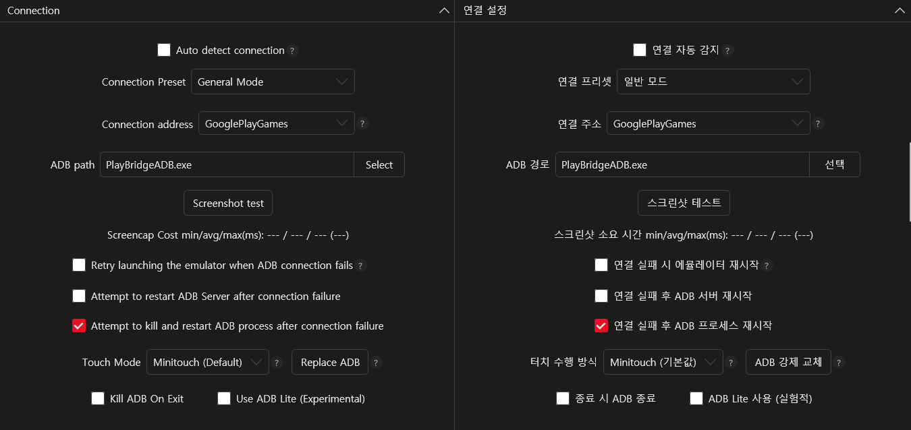

[English](README.md) | **한국어**

> [!IMPORTANT]
> 이 프로젝트는 원본 [PlayBridge](https://github.com/ACK72/PlayBridge)의 커스텀 포크입니다.

## 설치

> [!TIP]
> 문제가 있을 경우 MAA의 도구 탭에서 **`Peep`** 기능을 사용해 확인하세요. 
> 첫 실행 시 `로그인` 기능을 활성화하는 것을 권장합니다.

1. **[`Install.bat`](https://github.com/HX3N/PlayBridge/releases/latest)** 을 다운로드하여 MAA 폴더에서 실행하세요. 최신 `PlayBridgeADB.exe`와 `external_renderer_ipc.dll`을 자동으로 다운로드하고 배치합니다 (DLL을 위해 `PlayExtras\nx_device\15.0\shell\sdk\` 폴더를 생성합니다).
2. **MAA > 설정 > 연결**로 이동하여 아래와 같이 설정하세요:

| ADB 경로          | 연결 주소       | 연결 프리셋     | 터치 모드 | MuMu 설치 경로 | 스크린샷 향상 모드 |
| ----------------- | --------------- | --------------- | --------- | -------------- | ------------------ |
| PlayBridgeADB.exe | GooglePlayGames | MuMu 에뮬레이터 | Minitouch | `PlayExtras`   | 활성화             |

작동 원리

PlayExtras는 MAA의 **MumuExtras** 흐름을 모방합니다. MAA가 벤더 `external_renderer_ipc.dll`을 인프로세스로 로드하고 nemu ABI를 통해 프레임버퍼를 가져옵니다. PlayBridge는 동일한 ABI를 내보내는 드롭인 DLL을 제공하지만, 실제로는 WGC 데몬에서 프레임을 가져옵니다. 데몬은 필요 시 시작되고 유휴 상태에서 자동 종료되며, 실행 불가 시 표준 캡처 방식으로 폴백합니다.

## 단독 실행

`PlayBridgeADB`를 직접 실행하면 **Google Play Games**의 스크린샷을 캡처하여 바탕화면에 저장합니다. 
`--debug`를 붙이면 디버그 모드를 토글할 수 있습니다 (또는 레지스트리 값 `Software\PlayBridge\config\DEBUG_CAPTURE`를 직접 수정).

## RawByNc (레거시)

> [!WARNING]
> 비권장 — PlayExtras보다 느립니다. PlayExtras를 사용할 수 없는 경우에만 사용하세요.

[PlayBridgeADB](https://github.com/HX3N/PlayBridge/releases/latest)를 다운로드하여 MAA 폴더 안에 배치한 후 아래와 같이 설정하세요:

| ADB 경로      | 연결 주소       | 연결 프리셋 | 터치 모드 |
| ------------- | --------------- | ----------- | --------- |
| PlayBridgeADB | GooglePlayGames | 일반 모드   | Minitouch |

