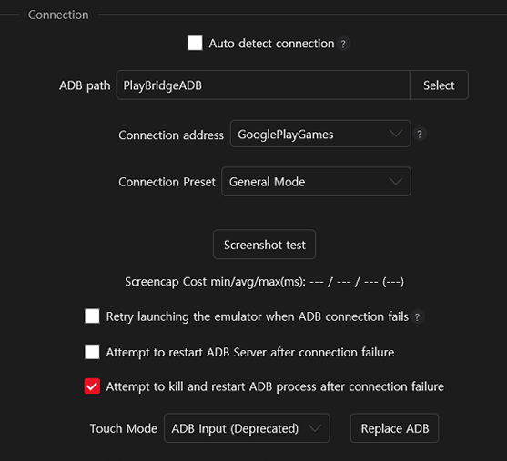

> [!IMPORTANT]
> This is a customized fork of the original [PlayBridge](https://github.com/ACK72/PlayBridge).

> [!NOTE]
> On a `7800X3D`, RawByNc averages **50ms** per screenshot, while Encode averages **80ms**. 
> To check for any issues, use the **`Peep`** feature in MAA's Toolbox tab. 
> Recommended to enable `Login` feature on the first launch.

## Setup

Download [PlayBridgeADB](https://github.com/HX3N/PlayBridge/releases/latest) and place it inside the MAA folder 
Then, go to **MAA > Settings > Connection** and configure as follows:

| ADB path      | Connection address | Connection Preset         | Touch Mode |
| ------------- | ------------------ | ------------------------- | ---------- |
| PlayBridgeADB | GooglePlayGames    | General (Compatible Mode) | Minitouch  |

> [!TIP]
> **Minitouch** is the only supported input method. 
> **ADB Input** is no longer supported.

## Screenshot

Running the executable directly captures a screenshot of **Google Play Games** and saves it to the Desktop

## Debug Capture

Run `.\PlayBridgeADB --debug` in the directory where the executable is located to toggle debug mode 
You can also modify the registry value directly at `Software\PlayBridge\config\DEBUG_CAPTURE`
